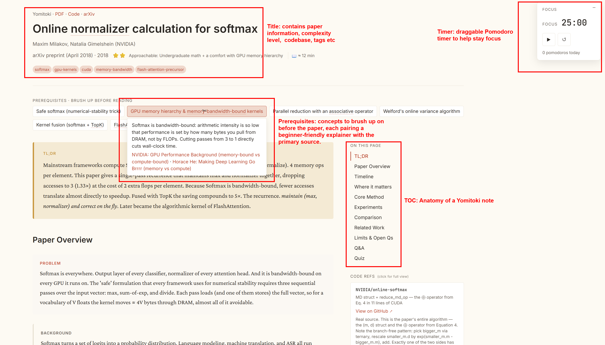
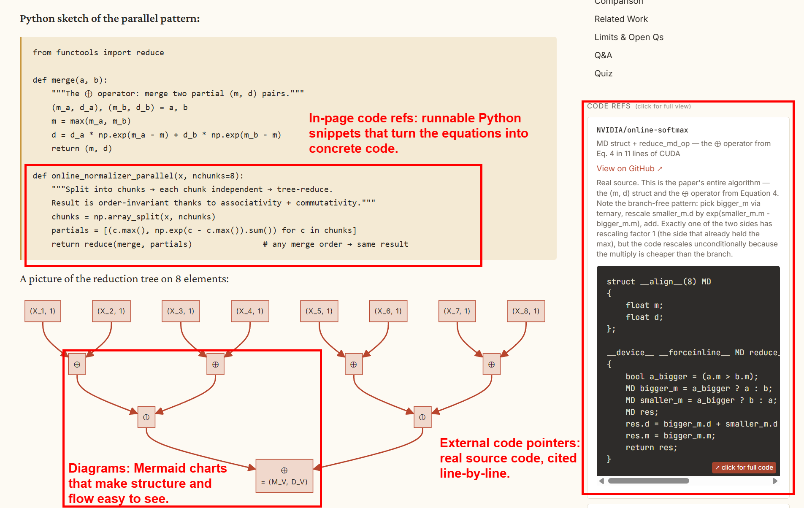

# yomitoki

Turn a research paper into a faithful, technical, code-augmented HTML reading note.

`yomitoki` (読み解き, "reading and interpreting") is an [agent skill](https://docs.claude.com/en/docs/claude-code/skills) plus a small Python toolchain that converts a paper (arXiv link, arXiv ID, PDF path, or PDF URL) into a self-contained HTML study note. The note is written like a strong technical blog post: it leads with the contrast between the old approach and the paper's move, anchors figures to the prose they explain, and links claims to real source-code line ranges.

A finished note answers five questions:

1. Why did this paper need to exist?
2. What exactly is the move the paper makes?
3. Why does that move work?
4. Where does it win, by how much, and where does it stop winning?
5. How would I start implementing or verifying it?

## See it in action

An annotated tour of one rendered note (the [online-softmax example](examples/online-softmax/index.html)):



*Anatomy: header metadata and tags, a draggable focus timer, prerequisites (a beginner intro plus the primary source per concept), the section map, and inline code refs.*



*Method detail: runnable Python snippets that turn the equations into code, Mermaid schematics for structure and flow, and external pointers into the real implementation at exact line ranges.*

**▶ Check out the live demo:** [open the online-softmax note rendered](https://kkur0same.github.io/yomitoki/examples/online-softmax/index.html).

## What it produces

A single `index.html` (plus `styles.css`, `main.js`, and curated `figures/`) containing: header metadata, prerequisites, TL;DR, paper overview, a verified tech-lineage timeline, a code-augmented core-method section, experiments, a methods comparison, limitations, and a Q&A + quiz. KaTeX renders math; Mermaid renders schematics when the paper warrants one.

## How it works

The pipeline is two scripts plus model-authored working files:

```
paper (arXiv / PDF)
   │   scripts/extract.py
   ▼
extracted.txt + figures/ + figures.json + skeleton analysis.json
   │   you (or an agent) author coverage.md, compact analysis.json,
   │   coderefs.json, and sections/*.html
   ▼
   │   scripts/assemble.py --check
   ▼
index.html  (self-contained reading note)
```

`extract.py` pulls text and figures from the paper. A human or an agent then writes `coverage.md` as the section plan and coverage ledger, keeps `analysis.json` compact, puts long prose in `sections/*.html`, and records code pointers in `coderefs.json`. `assemble.py` renders everything to HTML and validates it with `--check` (anchor phrases, figure references, KaTeX delimiters, timeline, and more).

## Use as a Claude Code skill

Clone into your skills directory so the agent can invoke it:

```bash
git clone git@github.com:kkur0same/yomitoki.git ~/.claude/skills/yomitoki
```

Then in Claude Code: `/yomitoki <arxiv-url | pdf-path | paper-title>`. The agent reads [`SKILL.md`](SKILL.md) and drives the workflow end to end. (Works with any harness that loads `SKILL.md`-style skills.)

## Use standalone

```bash
pip install -r requirements.txt          # pypdf, pymupdf; pandoc optional

# 1. Extract
python3 scripts/extract.py <arxiv-url|pdf-path|pdf-url> --out /tmp/yomitoki/my-paper/

# 2. Author coverage.md, compact analysis.json, sections/*.html, and coderefs.json
#    (see SKILL.md and references/code-ref-waterfall.md)

# 3. Assemble + validate
python3 scripts/assemble.py \
  --analysis  /tmp/yomitoki/my-paper/analysis.json \
  --coderefs  /tmp/yomitoki/my-paper/coderefs.json \
  --figures   /tmp/yomitoki/my-paper/figures/ \
  --assets    assets \
  --out       ./yomitoki-out/my-paper/ \
  --check
```

Open the resulting `yomitoki-out/my-paper/index.html` in a browser.

## Repository layout

| Path | Purpose |
|---|---|
| `SKILL.md` | Skill definition and authoring workflow the agent follows. |
| `scripts/extract.py` | Paper extraction: text, figures, skeleton `analysis.json`. |
| `scripts/assemble.py` | HTML rendering and `--check` validation (stdlib only). |
| `references/code-ref-waterfall.md` | How to source and anchor code references. |
| `references/diagrams.md` | Figure curation and Mermaid safety. |
| `references/method-example.md` | How to structure core method section. |
| `assets/` | `styles.css` and `main.js` copied into each note. |
| `examples/` | Rendered sample notes (see [`examples/README.md`](examples/README.md)). |

## Examples

[`examples/`](examples/) holds rendered reading notes as reference output. Start with [`examples/online-softmax/index.html`](examples/online-softmax/index.html) (open in a browser).

## Requirements

- Python 3.10+
- `pypdf` and `pymupdf` (`pip install -r requirements.txt`)
- `pandoc` optional, for cleaner text extraction

## License

[MIT](LICENSE)
